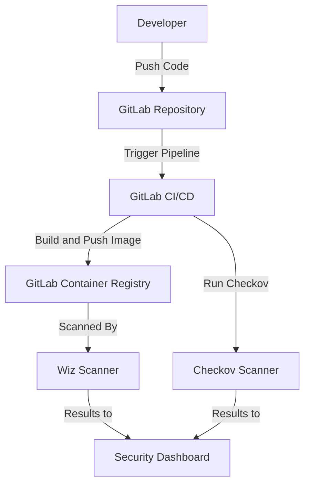
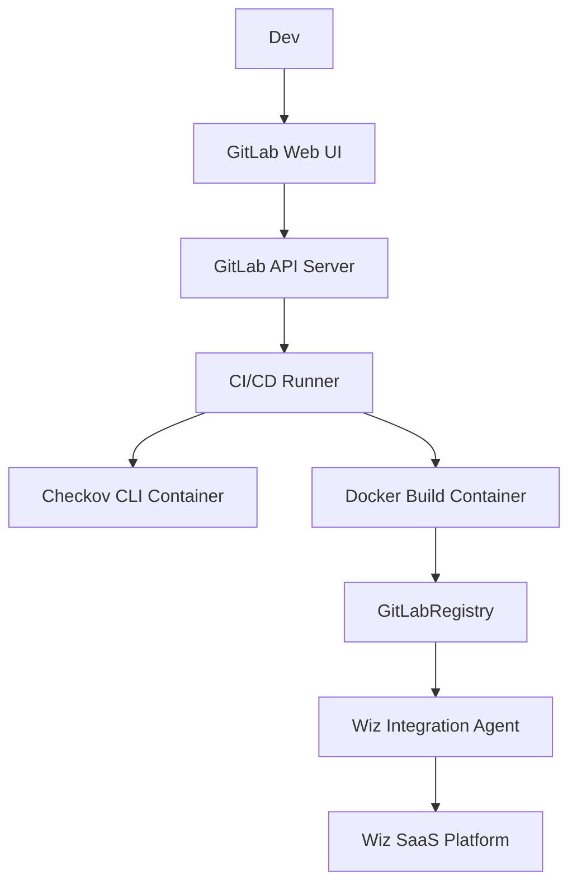
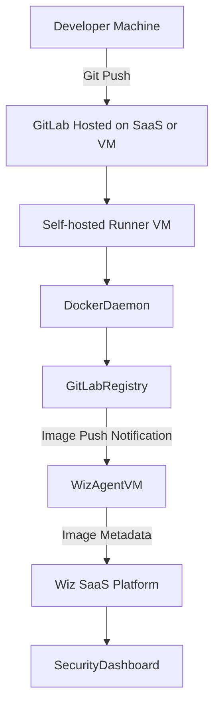

## BUSINESS POSTURE

The goal of this system is to integrate security into the CI/CD pipeline by enforcing policy-as-code and cloud security posture management (CSPM) scans using Checkov and Wiz. The organization values automation, security compliance, and visibility into vulnerabilities early in the development lifecycle. This system supports both infrastructure-as-code (IaC) and container security scanning, improving the security posture and minimizing risks of deploying vulnerable artifacts to production.

**Business Priorities and Goals**
- Ensure secure and compliant code is deployed to production environments.
- Enable early detection of misconfigurations and vulnerabilities.
- Maintain DevOps velocity while enforcing security controls.
- Automate security checks with minimal manual intervention.
- Reduce time to remediation through shift-left practices.

**Most Important Business Risks**
- Deployment of insecure or non-compliant resources due to unscanned or improperly scanned assets.
- Operational disruption due to vulnerabilities in critical services or containers.
- Audit failure due to lack of evidence of security scanning and enforcement.
- Loss of trust from stakeholders if a breach occurs through insecure CI/CD pipelines.

## SECURITY POSTURE

**Existing Security Controls**
- `security control` Use of GitLab protected branches to restrict deployments.
- `security control` Scan IaC with Checkov during GitLab CI/CD pipelines.
- `security control` Wiz integration for scanning registries and cloud configurations.
- `security control` Role-based access control (RBAC) in GitLab and cloud environments.

**Accepted Risks**
- `accepted risk` Some repositories may be excluded from scanning due to legacy compatibility or tooling conflicts.
- `accepted risk` Security alert triage may be delayed in non-critical environments.

**Recommended High-Priority Security Controls**
- `security control` Enforce mandatory pipeline scans with failing policies in GitLab for production branches.
- `security control` Periodic rescan of registries via scheduled Wiz integration jobs.
- `security control` Alerting pipeline integrated with Slack/Teams for real-time issue escalation.
- `security control` Secrets scanning via GitLab and Checkov plugins.
- `security control` Implement OPA-based policy enforcement as part of Checkov configuration.

**Security Requirements**
- GitLab CI/CD must prevent promotion of unscanned or failed scan artifacts.
- Checkov must scan IaC files (Terraform, CloudFormation, etc.) on every commit.
- Wiz must scan container images in the GitLab container registry and detect runtime misconfigurations.
- All scan results must be stored and auditable for at least 90 days.
- Developers must receive actionable feedback within their merge requests.

## DESIGN

### C4 CONTEXT

#### Context Diagram Table

| Name                | Type         | Description                                             | Responsibilities                                                      | Security Controls                                                                 |
|---------------------|--------------|---------------------------------------------------------|------------------------------------------------------------------------|------------------------------------------------------------------------------------|
| Developer           | Human        | Developer writing infrastructure and app code           | Write code, push to GitLab                                             | GitLab RBAC, MFA, protected branches                                              |
| GitLab Repository   | System       | Version control system hosting repositories             | Store code, manage branches                                            | Protected branches, commit signing, access control                                |
| GitLab CI/CD        | System       | CI/CD pipeline runner for builds, tests, scans          | Run pipelines, orchestrate security scans                              | Runner isolation, secrets masking, pipeline RBAC                                  |
| Checkov Scanner     | System       | Scans IaC code for policy violations                    | Evaluate Terraform/CloudFormation templates against security policies  | Policy enforcement, output validation                                              |
| GitLab Registry     | System       | Stores built Docker/container images                    | Host images produced during pipeline                                   | Scanning enforcement, access control                                               |
| Wiz Scanner         | System       | Scans registries and deployed cloud resources           | Perform CSPM, registry scanning                                        | RBAC, API integration with GitLab                                                  |
| Security Dashboard  | System       | Aggregates and displays scan results                    | Central view of vulnerabilities and policy violations                  | Access control, role-based visibility, audit logging                              |

### C4 CONTAINER

#### Container Diagram Table

| Name               | Type      | Description                                         | Responsibilities                                                | Security Controls                                                        |
|--------------------|-----------|-----------------------------------------------------|------------------------------------------------------------------|---------------------------------------------------------------------------|
| GitLab Web UI      | UI        | Interface for developers                            | Allows repo interaction, MR creation                            | Session timeout, XSS/CSRF protections                                     |
| GitLab API Server  | Service   | Backend for GitLab CI/CD                            | Handles pipeline triggers, repo interactions                    | RBAC, API token restrictions                                              |
| CI/CD Runner       | Container | Executes jobs defined in `.gitlab-ci.yml`           | Orchestrate Checkov, builds, tests                              | Runner isolation, network segmentation                                    |
| Checkov CLI        | Container | Runs Checkov policies on IaC                        | Validate IaC on commit or MR                                    | Policy version pinning, fail pipelines on violation                       |
| Docker Build       | Container | Builds application/container image                  | Compile code, prepare image                                     | Use trusted base images, signed commits                                   |
| GitLab Registry    | Registry  | Stores container images                             | Push/pull container images used in deployments                  | Scanning enforcement, signed images, access control                       |
| Wiz Agent          | Agent     | Bridge between GitLab and Wiz SaaS                  | Pull images, submit metadata to Wiz                             | API token scoping, restricted read-only permissions                       |
| Wiz Platform       | SaaS      | Cloud Security Posture and Registry Scanner         | Analyze image, generate alerts                                  | RBAC, SSO, audit logging                                                  |

### C4 DEPLOYMENT

#### Deployment Diagram Table

| Name              | Type         | Description                                                | Responsibilities                                      | Security Controls                                                        |
|-------------------|--------------|------------------------------------------------------------|------------------------------------------------------|---------------------------------------------------------------------------|
| Developer Machine | Workstation  | Local machine used by developers                           | Author code and push changes                         | Endpoint protection, VPN, Git commit signing                             |
| GitLab Server     | SaaS/VM      | Hosts GitLab web and CI/CD                                 | Receive pushes, trigger pipelines                    | Secure hosting, TLS, IP whitelisting                                     |
| CI/CD Runner VM   | VM           | Dedicated runner for GitLab CI/CD                          | Run Checkov, builds, and push images                 | Network isolation, limited permissions, ephemeral runner lifecycle       |
| Docker Daemon     | Service      | Handles image builds and pushing to registry               | Build and tag container images                       | Hardened configuration, logging                                          |
| GitLab Registry   | Registry     | Container image registry                                   | Store and serve container images                     | Scanning enabled, role-based access                                      |
| Wiz Agent VM      | VM           | Hosts the scanning agent                                   | Sync with GitLab Registry and send to Wiz SaaS       | Minimal footprint, controlled egress                                     |
| Wiz Cloud         | SaaS         | Performs registry and configuration scanning               | Store results, provide alerts                        | Managed SSO, tenant isolation                                            |
| Security Dashboard| Dashboard    | Aggregated view of issues and policy violations            | Display scan results, track remediation              | Access control, audit logs                                               |

## RISK ASSESSMENT

**Critical Business Processes to Protect**
- Automated CI/CD deployments to production.
- Infrastructure provisioning through IaC templates.
- Image registry used in all environments.

**Sensitive Data to Protect**
- Source code and IaC definitions (moderate to high sensitivity).
- Container images (moderate sensitivity, could contain secrets if not filtered).
- Scan results (moderate sensitivity, may expose vulnerabilities and misconfigs).

## QUESTIONS & ASSUMPTIONS

**Questions**
1. Should all GitLab projects be scanned, or is this scoped only to production-facing repos?
2. Is the GitLab instance self-managed or SaaS (GitLab.com)?
3. Should scan failures block deployment or just alert?
4. Are there specific compliance standards to enforce (e.g., CIS, PCI, ISO)?

**Assumptions**
- All IaC is written in Terraform.
- GitLab container registry is the primary image registry.
- Checkov policies are maintained internally and version-controlled.
- Wiz has access to the GitLab container registry and cloud account metadata.
- Developers are trained to interpret scan results and take remediation action.

Would you like a GitLab CI pipeline example integrating Checkov and Wiz next?
